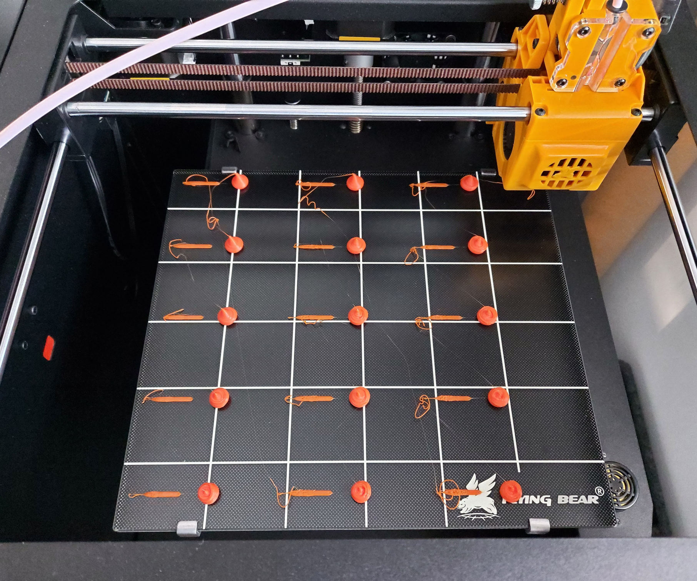
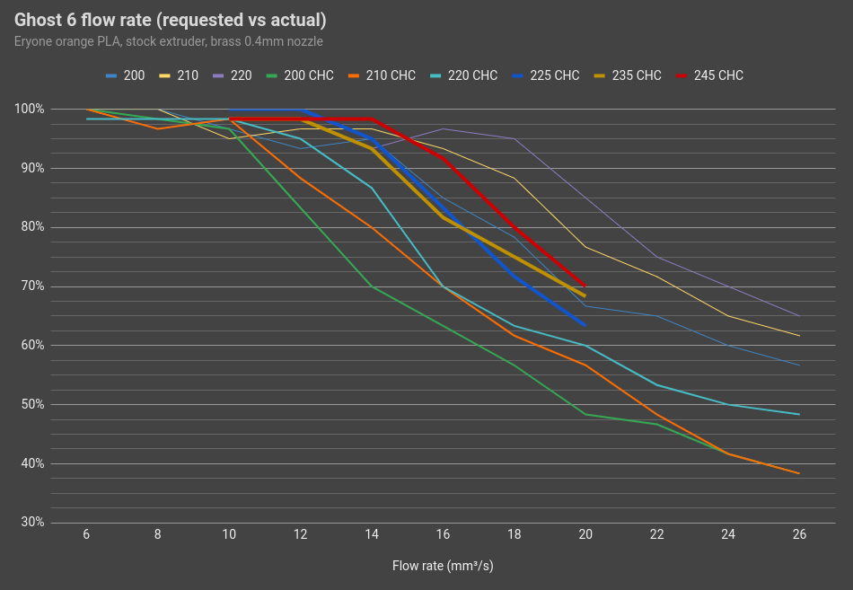

# Ghost 6 stock extruder & hot-end performance

Tests conducted using Eryone orange PLA (1.75mm).

I used a [flow test generator](https://hotend-flow-tester.netlify.app/) to produce Gcode requesting a range of flow rates 
across three printing temperatures: 200˚C, 210˚C and 220˚C.

This is replicates method used by [CNC Kitchen](https://www.youtube.com/watch?v=0xRtypDjNvI), 
weighing the extruded PLA and comparing it to the requested flow rate in mm3/s.

When fitting a CHC I also switched the nozzle from brass to tungsten carbide to print abrasive filament. Carbide nozzles have approx 80% of the thermal conductivity of brass, and benefit from slightly higher printing temperatures.

Flow rate requested and weight extruded (g) using a brass 0.4mm nozzle.

| Temp | 6 | 8 | 10 | 12 | 14 | 16 | 18 | 20 | 22 | 24 | 26 |
| :--- | :---: | :---: | :---: | :---: | :---: | :---: | :---: | :---: | :---: | :---: | :---: |
| 200 | 0.6 | 0.6 | 0.58 | 0.56 | 0.57 | 0.51 | 0.47 | 0.4 | 0.39 | 0.36 | 0.34 |
| 200 CHC | 0.6 | 0.59 | 0.58 | 0.5 | 0.42 | 0.38 | 0.34 | 0.29 | 0.28 | 0.25 | 0.23 |
| 210 | 0.6 | 0.6 | 0.57 | 0.58 | 0.58 | 0.56 | 0.53 | 0.46 | 0.43 | 0.39 | 0.37 |
| 210 CHC | 0.6 | 0.58 | 0.59 | 0.53 | 0.48 | 0.42 | 0.37 | 0.34 | 0.29 | 0.25 | 0.23 |
| 220 | 0.6 | 0.58 | 0.59 | 0.59 | 0.56 | 0.58 | 0.57 | 0.51 | 0.45 | 0.42 | 0.39 |
| 220 CHC | 0.59 | 0.59 | 0.59 | 0.57 | 0.52 | 0.42 | 038 | 0.36 | 0.32 | 0.3 | 0.29 |
| 225 CHC | - | - | 0.6 | 0.6 | 0.57 | 0.5 | 0.43 | 0.38 | - | - | - |
| 235 CHC | - | - | 0.59 | 0.59 | 0.56 | 0.49 | 0.45 | 0.41 | - | - | - |
| 245 CHC | - | - | 0.59 | 0.59 | 0.59 | 0.55 | 0.48 | 0.42 | - | - | - |

Taking 0.6g as the maximum and dividing all test results into this, we 
can see the relative flow rate (under) performance.

| Temp | 6 | 8 | 10 | 12 | 14 | 16 | 18 | 20 | 22 | 24 | 26 |
| :--- | :---: | :---: | :---: | :---: | :---: | :---: | :---: | :---: | :---: | :---: | :---: |
| 200 | 100 | 100 | 96.67 | 93.33 | 95.00 | 85.00 | 78.33 | 66.67 | 65.00 | 60.00 | 56.67 |
| 200 CHC | 100 | 98.33 | 96.67 | 83.33 | 70.00 | 61.67 | 56.67 | 48.33 | 46.67 | 41.67 | 38.33 | 
| 210 | 100 | 100 | 95.00 | 96.67 | 96.67 | 93.33 | 88.33 | 76.67 | 71.67 | 65.00 | 61.67 |
| 210 CHC | 100 | 96.67 | 98.33 | 88.33 | 80.00 | 70.00 | 61.67 | 56.67 | 48.33 | 41.67 | 38.33 |
| 220 | 100 | 96.67 | 98.33 | 98.33 | 93.33 | 96.67 | 95.00 | 85.00 | 75.00 | 70.00 | 65.00 |
| 220 CHC | 98.33 | 98.33 | 98.33 | 95.00 | 86.67 | 70.00 | 63.33 | 60.00 | 53.33 | 50.00 | 48.33 |
| 225 CHC | - | - | 100 | 100 | 95.00 | 83.33 | 71.67 | 63.33 | - | - | - |
| 235 CHC | - | - | 98.33 | 98.33 | 93.33 | 81.67 | 75.00 | 68.33 | - | - | - |
| 245 CHC | - | - | 98.33 | 98.33 | 98.33 | 91.67 | 80.00 | 70.00 | - | - | - |

The chart suggests a nozzle temp of around 240C might help restore flow rates. I'm yet to print at that temperature and assess the quality.