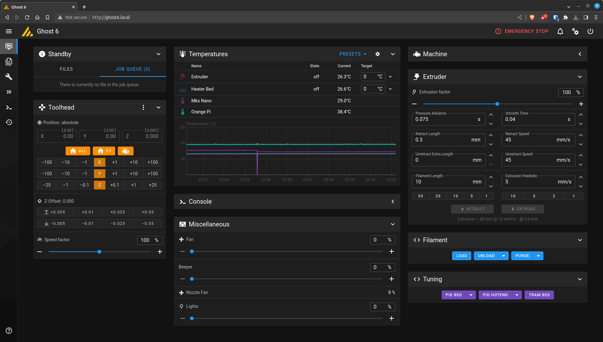

## Klipper



> **Note:** I don't run an ABL probe or a webcam.

This configuration assumes the following directory structure (in `/home/pi` but could be any directory):

```bash
├── ghost6
│   ├── backup
│   ├── certs
│   ├── comms
│   ├── config
│   ├── database
│   ├── gcodes
│   ├── logs
│   ├── mainsail
│   └── systemd
├── klipper
│   ├── config
│   ├── docs
│   ├── klippy
│   ├── lib
│   ├── out
│   ├── scripts
│   ├── src
│   └── test
├── klippy-env
│   ├── bin
│   ├── include
│   └── lib
├── moonraker
│   ├── docs
│   ├── moonraker
│   ├── scripts
│   └── tests
└── moonraker-env
    ├── bin
    └── lib
```

### printer.cfg
```yaml
[display_status]

[gcode_arcs]
# Arc welder support

[pause_resume]

[virtual_sdcard]
path: ~/ghost6/gcodes

# This file contains common pin mappings for MKS Robin Nano V3
# boards. To use this config, the firmware should be compiled for the
# stm32f407. When running "make menuconfig", select the 48KiB
# bootloader.

# The "make flash" command does not work on the MKS Robin. Instead,
# after running "make", copy the generated "out/klipper.bin" file to a
# file named "Robin_nano_v3.bin" on an SD card and then restart the
# MKS Robin with that SD card.

[stepper_x]
step_pin: PE3
dir_pin: !PE2
enable_pin: !PE4
microsteps: 16
rotation_distance: 20
endstop_pin: !PA15
position_endstop: 1
position_max: 255
homing_speed: 50

[stepper_y]
step_pin: PE0
dir_pin: !PB9
enable_pin: !PE1
microsteps: 16
rotation_distance: 20
endstop_pin: !PD2
position_endstop: 1
position_max: 215
homing_speed: 50

[stepper_z]
step_pin: PB5
dir_pin: !PB4
enable_pin: !PB8
microsteps: 16
rotation_distance: 4
endstop_pin: !PC8
homing_speed: 14
second_homing_speed: 2
position_min: -5
position_max: 205

[extruder]
dir_pin: PD3
enable_pin: !PB3
filament_diameter: 1.750
heater_pin: PE5
max_extrude_only_distance: 600
max_extrude_cross_section: 14.4
microsteps: 32
min_extrude_temp: 180
min_temp: 0
max_temp: 290 # use 240 here for stock hot-end
nozzle_diameter: 0.600 # stock nozzle = 0.4
rotation_distance: 15.332
sensor_pin: PC1
# sensor_type: ATC Semitec 104GT-2
sensor_type: EPCOS 100K B57560G104F
step_pin: PD6

[firmware_retraction]
retract_length: 0.6
retract_speed: 45
unretract_extra_length: 0
unretract_speed: 40

[heater_fan nozzle_fan]
pin: PC14
shutdown_speed: 1.0
heater: extruder
heater_temp: 50
fan_speed: 1.0

[fan]
pin: PB1 # Part cooling

[heater_bed]
heater_pin: PA0
sensor_type: EPCOS 100K B57560G104F
sensor_pin: PC0
min_temp: 0
max_temp: 115

[bed_screws] # bed tramming
screw1: 28,31
screw1_name: Front Left
screw2: 228,31
screw2_name: Front Right
screw3: 228,181
screw3_name: Back Right
screw4: 28,181
screw4_name: Back Left
speed: 150

[mcu]
serial: /dev/ttyS5 # UART connection
restart_method: command

[printer]
kinematics: corexy
max_velocity: 250
max_accel: 3000
max_accel_to_decel: 1500
max_z_velocity: 25
max_z_accel: 100

[temperature_sensor orange_pi]
sensor_type: temperature_host
min_temp: 10
max_temp: 100

[temperature_sensor mks_nano]
sensor_type: temperature_mcu
min_temp: 0
max_temp: 100

[output_pin beeper]
pin: PC5
pwm: true
value: 0
shutdown_value: 0
cycle_time: 0.001

[led lights] # chamber 'floodlight'
white_pin: !PE6

########################################
# EXP1 / EXP2 (display) pins
########################################

# Display not functional with klipper
[board_pins]
aliases:
    # EXP1 header
    EXP1_1=PC5,  EXP1_3=PD13, EXP1_5=PE14, EXP1_7=PD11, EXP1_9=<GND>,
    EXP1_2=PE13, EXP1_4=PC6,  EXP1_6=PE15, EXP1_8=PD10, EXP1_10=<5V>,
    # EXP2 header
    EXP2_1=PA6, EXP2_3=PE8, EXP2_5=PE11, EXP2_7=PE12,  EXP2_9=<GND>,
    EXP2_2=PA5, EXP2_4=PE10, EXP2_6=PA7, EXP2_8=<RST>, EXP2_10=<3.3v>
    # Pins EXP2_1, EXP2_6, EXP2_2 are also MISO, MOSI, SCK of bus "ssp1"

# See the sample-lcd.cfg file for definitions of common LCD displays.

[include macros.cfg]
```

### macros.cfg

```yaml
[gcode_macro PAUSE]
description: Pause the actual running print
rename_existing: PAUSE_BASE
gcode:
  PAUSE_BASE
  _TOOLHEAD_PARK_PAUSE_CANCEL

[gcode_macro RESUME]
description: Resume the actual running print
rename_existing: RESUME_BASE
gcode:
  ##### read extrude from  _TOOLHEAD_PARK_PAUSE_CANCEL  macro #####
  
  #### get VELOCITY parameter if specified ####
  
    
  
    
  
  ##### end of definitions #####
  
    M83
    G1 E{extrude} F2100
     M82 
  
    {action_respond_info("Extruder not hot enough")}
  


  RESUME_BASE {get_params}

[gcode_macro CANCEL_PRINT]
description: Cancel the actual running print
rename_existing: CANCEL_PRINT_BASE
variable_park: True
gcode:
  ## Move head and retract only if not already in the pause state and park set to true
  
    _TOOLHEAD_PARK_PAUSE_CANCEL
  
  TURN_OFF_HEATERS
  CANCEL_PRINT_BASE

[gcode_macro _TOOLHEAD_PARK_PAUSE_CANCEL]
description: Helper: park toolhead used in PAUSE and CANCEL_PRINT
variable_extrude: 1.0
gcode:
  ##### set park positon for x and y #####
  # default is your max posion from your printer.cfg
  
  
  
  ##### calculate save lift position #####
  
  
  
    
  
    
  
  ##### end of definitions #####
  
    M83
    G1 E-{extrude} F2100
     M82 
  
    {action_respond_info("Extruder not hot enough")}
  
  
    G91
    G1 Z{z_safe} F900
    G90
    G1 X{x_park} Y{y_park} F6000
     G91 
  
    {action_respond_info("Printer not homed")}
  

# From: https://github.com/Klipper3d/klipper/blob/master/config/sample-macros.cfg
[gcode_macro M600]
description: Starts process of Filament Change
gcode:
    
    
    
    SAVE_GCODE_STATE NAME=M600_state
    PAUSE
    G91
    G1 E-.8 F2700
    G1 Z{Z}
    G90
    G1 X{X} Y{Y} F3000
    G91
    G1 E-90 F1000
    RESTORE_GCODE_STATE NAME=M600_state

[gcode_macro load]
description: Loads filament
gcode:
  
  
    M104 S190
    {action_respond_info("Hot-end temperature too low, heating to 190C ...")}
  
    SAVE_GCODE_STATE NAME=LOAD_state
    G91 # relative movement
     # if bed closer than 25mm
         # conditionally home Z
        G28 Z 
      
      G90 # absolute movement
      G1 Z25 F1200 # Move bed to 25mm below nozzle
      G91 # relative movement
    
    G1 E80 F{ 5 * 60 }    # extrude
    G4 P1000              # dwell 1s
    G1 E50.0 F{ 5 * 60 }  # extrude a little more
    RESTORE_GCODE_STATE NAME=LOAD_state
  
 
[gcode_macro purge]
description: Extrudes filament to purge previous filament
gcode:
  
  
    M104 S190
    {action_respond_info("Hot-end temperature too low, heating to 190C ...")}
  
  
    SAVE_GCODE_STATE NAME=PURGE_state
    G91 # relative movement
    G1 E{PURGE_AMOUNT} F{ 5 * 60 } # purge
    RESTORE_GCODE_STATE NAME=PURGE_state
  

[gcode_macro unload]
description: Unloads filament
gcode:
  
  
    M104 S190
    {action_respond_info("Hot-end temperature too low, heating to 190C ...")}
  
    SAVE_GCODE_STATE NAME=UNLOAD_state
    G91 # relative movement
     # if bed closer than 25mm
         # conditionally home Z
        G28 Z 
      
      G90 # absolute movement
      G1 Z25 F1200 # Move bed to 25mm below nozzle
      G91 # relative movement
   
    # Reset extruder position
    G92 E0
    G1 E5.0 F300          # extrude a little
    G1 E-55 F{ 10 * 60 }  # perform the unload
    G1 E-55 F{ 5 * 60 }   # finish the unload
    RESTORE_GCODE_STATE NAME=UNLOAD_state
  

[gcode_macro PID_Hotend]
gcode:
  
  PID_CALIBRATE HEATER=extruder TARGET={T}

[gcode_macro PID_Bed]
gcode:
  
  PID_CALIBRATE HEATER=heater_bed TARGET={T}

[gcode_macro TRAM_BED]
gcode:
  
    G28
  
  BED_SCREWS_ADJUST
```

## Moonraker

This is SBC specific, depending on your install layout. Mine is in `/home/pi/ghost6`. I run avahi-daemon so I can use a `.local` domain for my printer.

```yaml
[server]
# Bind server defaults of 0.0.0.0, port 7125
klippy_uds_address: ~/ghost6/comms/klippy.sock

[announcements]
subscriptions:
  mainsail

[authorization]
cors_domains:
  http://ghost6.local:7125
trusted_clients:
  # Enter your client IP here or range here
  192.168.0.0/24

[file_manager]
enable_object_processing: False

[history]

# Enable OctoPrint compatibility for Slicer uploads
# Supports Cura, Slic3r, and Slic3r dervivatives
# (PrusaSlicer, SuperSlicer)
[octoprint_compat]
webcam_enabled: False

[update_manager]
refresh_interval: 168
enable_auto_refresh: True

[update_manager mainsail]
type: web
channel: stable
repo: mainsail-crew/mainsail
path: ~/ghost6/mainsail
```