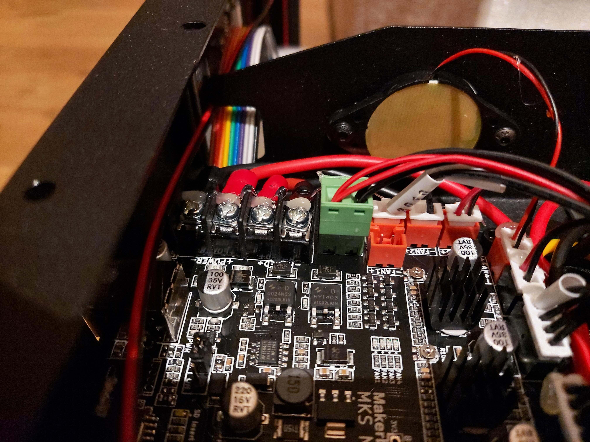

# FlyingBear Ghost 6

This 3D printer is an affordable Core XY option. I documented my assembly steps with additional information to supplement the manual, this may help those looking to make upgrades.


**Sections**

- [Motherboard](#motherboard)
  - [Firmware](#stock-firmware)
  - [PID tune](#pid-tune)
- [Hot-end](#hot-end)
- [Z Stop](#z-stop)
- [PTFE Tube](#ptfe-tube)
- [Upgrades](#upgrades)

[Nathan Builds Robots](https://www.youtube.com/@NathanBuildsRobots) posted a [review of this machine](https://www.youtube.com/watch?v=OnHAltxwU58), including some upgrades to the power connections and heat-break. I used this as a springboard of items to check when assembling my own Ghost 6.

## Motherboard

As of March 2023 FlyingBear appear to ship the Ghost 6 with fork connectors on the power cables, a welcome change from tinned wires as seen in NBR's review.



The motherboard is a [Makerbase Robin V3.1](https://www.makerbase.store/products/makerbase-mks-robin-nano-v3) (OEM Nano4 variant?) with four soldered stepper drivers and a socket to install an additional driver. The processor is a 32-bit single-core [STM32F407VET6](https://www.st.com/en/microcontrollers-microprocessors/stm32f407ve.html) running at 168Mhz.


This board ships running Marlin 2.x but also supports RepRapFirmware (RRF) and Klipper. Firmware images are available from the Makerbase [Nano V3 Github repository](https://github.com/makerbase-mks/MKS-Robin-Nano-V3.X#firmware).

The electronics bay, the noisiest component is the 60mm fan cooling the motherboard. The PSU fan is temperature controlled and only runs when needed.


It's encouraging to see the frame has been grounded with a 16AWG earth wire (bottom left).

This is a low profile [6010 fan](https://3dflyingbear.com/collections/ghost-6-parts/products/ball-bearing-fan-6010-for-3d-printer-ghost-6-5-4s-4). The noise it emits is exacerbated by it's close proximity to the metal side panel.


Ghost 6 [wiring diagram (PDF)](https://drive.google.com/drive/folders/1w9E5SNaONkKEqfmt8eS9ygdIeusIUjcJ), provided by FlyingBear:


A closer look at the MKS Nano4 V3.1 wiring:


### Stock firmware

Connecting to the printer via serial console over USB allows us to retrieve the firmware settings. I used Pronterface as a serial terminal client.

`M115`

```
FIRMWARE_NAME:Marlin 2.0.9.2 (Nov 11 2022 12:40:55)
SOURCE_CODE_URL:github.com/MarlinFirmware/Marlin
PROTOCOL_VERSION:1.0
MACHINE_TYPE:3D Printer
EXTRUDER_COUNT:1
UUID:xxxx-xxxx-xxxx-xxxx-xxxx
Cap:SERIAL_XON_XOFF:0
Cap:BINARY_FILE_TRANSFER:0
Cap:EEPROM:1
Cap:VOLUMETRIC:1
Cap:AUTOREPORT_POS:0
Cap:AUTOREPORT_TEMP:1
Cap:PROGRESS:0
Cap:PRINT_JOB:1
Cap:AUTOLEVEL:0
Cap:RUNOUT:0
Cap:Z_PROBE:0
Cap:LEVELING_DATA:0
Cap:BUILD_PERCENT:0
Cap:SOFTWARE_POWER:0
Cap:TOGGLE_LIGHTS:0
Cap:CASE_LIGHT_BRIGHTNESS:0
Cap:EMERGENCY_PARSER:0
Cap:HOST_ACTION_COMMANDS:0
Cap:PROMPT_SUPPORT:0
Cap:SDCARD:1
Cap:REPEAT:0
Cap:SD_WRITE:1
Cap:AUTOREPORT_SD_STATUS:0
Cap:LONG_FILENAME:0
Cap:THERMAL_PROTECTION:1
Cap:MOTION_MODES:0
Cap:ARCS:1
Cap:BABYSTEPPING:1
Cap:CHAMBER_TEMPERATURE:0
Cap:COOLER_TEMPERATURE:0
Cap:MEATPACK:0
```

`M503`

```gcode
echo:; Linear Units:
  G21 ; (mm)
echo:; Temperature Units:
echo:  M149 C ; Units in Celsius
echo:; Filament settings (Disabled):
echo:  M200 S0 D1.75
echo:; Steps per unit:
echo:  M92 X160.60 Y160.60 Z800.00 E405.00
echo:; Max feedrates (units/s):
echo:  M203 X200.00 Y200.00 Z4.00 E45.00
echo:; Max Acceleration (units/s2):
echo:  M201 X1500.00 Y1500.00 Z100.00 E2000.00
echo:; Acceleration (units/s2) (P<print-accel> R<retract-accel> T<travel-accel>):
echo:  M204 P1500.00 R3000.00 T2000.00
echo:; Advanced (B<min_segment_time_us> S<min_feedrate> T<min_travel_feedrate> X<max_x_jerk> Y<max_y_jerk> Z<max_z_jerk> E<max_e_jerk>):
echo:  M205 B20000.00 S0.00 T0.00 X15.00 Y15.00 Z0.40 E2.00
echo:; Home offset:
echo:  M206 X0.00 Y0.00 Z0.00
echo:; Hotend PID:
echo:  M301 P11.58 I0.61 D55.36
echo:; Bed PID:
echo:echo:  M304 P103.73 I17.06 D420.46
echo:; Power-loss recovery:
echo:  M413 S1 ; ON
```

> I was **not** able to read or set the driver current with `M906` ([Marlin docs](https://marlinfw.org/docs/gcode/M906.html)), most likely because the MKS Nano4 board uses TMC-2225 stepper drivers that aren't supported. The stock firmware returns 'Unknown command'.

### PID Tune

While I had a serial console session active, I took the opportunity to PID tune the hot-end and bed.

- Hot-end (200C):  
`M303 E0 S200 C6 U1`  
- Bed (60C):  
`M303 E-1 S60 C8 U1`  
- Save to EEPROM:  
`M500`

I encountered some errors after PID tuning using `U1` but the PID values had updated and just required saving (`M500`).

## Hot-end

I disassembled the hot-end enclosure to inspect the heat sink and heat-break dimensions. This printer has a PTFE lined hot-end that runs down to the nozzle. As with other printers like the Ender 3, this limits the print temperatures to 240C as above this the PTFE tube burns.

I have tested the stock extruder and hot-end [flow rate performance](flow.md).

The heat-break can be swapped out. It is a [Chimera](https://www.aliexpress.com/item/1005001728155269.html) style, M6 threaded bottom that screws into the heater block and a smooth J-head M7 throat that inserts into the cold-end heat sink (Aokin sell a cheaper [bi-metal TA-C smooth short](https://www.aliexpress.com/item/1005004234162702.html) variant).


The heat sink attachment in the yellow plastic hot-end enclosure appears bespoke. If you purchase an aftermarket alternative, you may need to drill and tap some M3 holes in the top of the heat sink near the perimeter to install it.


## Z Stop

I found my Z stop micro-switch was not level from factory. This was easily remedied as it is mounted on a plate fixed with two bolts (circled in red), screwed into the rear panel of the frame.


The Z stop plate bolts can be loosened from the rear of the machine.


## PTFE Tube

When installing the PTFE tube from the frame edge to the extruder I checked the tube dimensions versus some Capricorn and Creality ender 3 tubing. The factory tubing appears to match Capricorn inner and outer dimensions.


This printer has a direct drive extruder, slack in tube's filament path before reaching the extruder does not affect print quality versus Bowden configurations where the PTFE tube sits between the extruder and hot-end.

## Slicer settings

I use Cura 5 to slice models. There is no Ghost 6 profile (at the time of writing) so I selected Ghost 5 and modified the print bed size and Z height (255 x 215 x 215 XYZ).

Notable changes to date (PLA):

- Retraction distance: 3.3mm (down from 6.5mm)
- Minimum extrusion distance: 3mm (down from 10mm)

## Upgrades

### Hot-end

My [TriangleLabs CHC hot-end](https://www.aliexpress.com/item/1005002781227348.html) and [T-V6 hardened steel nozzle](https://www.aliexpress.com/item/4000974838587.html) has arrived, along with two (just in case) [Aokin bi-metal heat breaks](https://www.aliexpress.com/item/1005004234162702.html). Assembled this weighs 18g. When I install this upgrade I will weigh the original heat block and include it here.


### Klipper

Before assembly I checked the electronics bay to see if there was sufficient space for a Pi sized board, which there is not. I've only done preparatory work to accommodate adding a [single board computer](orange_pi_z2.md) to run klipper.

I bought some rubber spacers to raise the height of the feet. You could print these from TPU but I didn't think it was worth the effort. The top of the feet are 20mm in diameter, secured with an M4 bolt to the frame through the centre.


Without modification the bottom clearance is 19mm. My [Orange Pi Zero 2](orange_pi_z2.md) is 17mm in height, 5mm spacers would be sufficient to accommodate the OPi but as we need to use GPIO UART pins, the DuPont connectors and wire require additional clearance. Since taking this photo I've installed another 5mm spacer for a total of 15mm.


## Next

I have some modifications planned. I'll update these notes in due course but am happy with the quality of the hardware, particularly at this price point.

# Useful Ghost 6 repositories

- [Tom Tomich's Ghost 6 repository](https://github.com/Tombraider2006/klipperFB6) (Russian)
- [Technarrus klipper config (Orange Pi 3 LTS)](https://github.com/Technarrus/Klipper_FBG6) (Russian)